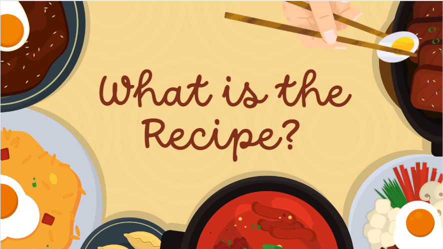

# What is the Recipe?

    

## Description

**What is the Recipe?**  is an app that creates a platform for users to explore recipes from various cuisines to create their next delicious meal. 

Regardless of skillset, users are able to search for recipes and the app will generate the "Top Trending" Youtube Shorts based on their search. 

What is the Recipe? was built using the MERN stack. The utilization of Semantic UI and Bootstrap were used to create a dynamic and responsive frontend. Additonally, GraphQL, JWT authentication and Google/Youtube API were incorporated on the backend development.

After creating your account, you explore the top trending Youtube Shorts to spark your next meal. This app is also responsive which is great for those on-the-go quick dinner ideas. 

**Home Page**

**Sign Up Page**

**Login Page**

**Search Page**

## Table of Contents

* [Technologies](#technologies)
* [Methodology](#methodology)
* [Usage](#usage)
* [License](#license)
* [Contributing](#contributing)
* [The Team](#the-team)

## Technologies

What Is The Recipe? was built using the following technologies:

* [Bootstrap](https://getbootstrap.com/) - Front-end framework
* [Express](https://expressjs.com/) - Middleware for routing HTTP requests
* [Node](https://nodejs.org/en/) - Backend API service
* [MongoDB Atlas](https://www.mongodb.com/home) - Connect to database sever
* [Apollo Server](https://www.apollographql.com/docs/apollo-server/) - GraphQL sever
* [React](https://reactjs.org/) - Built User Interface
* [GraphQL](https://graphql.org/) - Query Language for Google API
* [Semantic UI](https://semantic-ui.com/) - Front-end framework
* [Google API](https://developers.google.com/youtube/v3/docs/?apix=true) - Youtube API
* [dotenv](https://www.npmjs.com/package/dotenv) - Ignore sensative information
* [Bcrypt](https://www.npmjs.com/package/bcrypt) - Password Hashing
* [Heroku](https://www.heroku.com/) - Application and database hosting

## Methodology

Whether consumers are looking for a new recipe or watching their favorite foodie celebrity, food is thriving on YouTube. This past year Google has seen a growth of 280% in food channel subscriptions. ​

This growing trend is what inspired the creation of our app: What is the  Recipe?

Our app allows users to explore new recipes from various cuisines. If the user doesn’t know what they are looking for, they can click the top trending food images located on the main page for inspiration.​

Feel free to submit any features you'd like to see via the Issues section of this GitHub repo.
## Usage

Instructions:
Sign up or Log in to search and save top trending shorts.

## License

    This application is covered under ISC. To read view documentation about this license, please visit the link below.

https://opensource.org/licenses/ISC

## Contributing

Guidelines to contribute to this project:

 1. **Fork** the repo on GitHub
 2. **Clone** the project to your own machine
 3. **Commit** changes to your own branch
 4. **Push** your work back up to your fork
 5. Submit a **Pull request** so that we can review your changes

NOTE: Be sure to merge the latest from "upstream" before making a pull request!

## The Team
* Constance "Connie" Marie Strahan, Back End Development [@ConnieMarie](https://www.github.com/ConnieMarie)
* Daniela Lopez, Back End Development [@dlope0831](https://github.com/dlope0831)
* Jeniree Castro, Front End Development[@jenireeac](https://github.com/jenireeac)
* Shanice Sauceda, Front End Development[@shanicesauce](https://github.com/shanicesauce)

To find out more about the inspiration behind this project, check out our presentation here: [What Is The Recipe? Presentation](https://www.canva.com/design/DAFVbUsSrPM/-9gjpSwo13-zjqhSEDWcFQ/view?utm_content=DAFVbUsSrPM&utm_campaign=designshare&utm_medium=link2&utm_source=sharebutton)  

